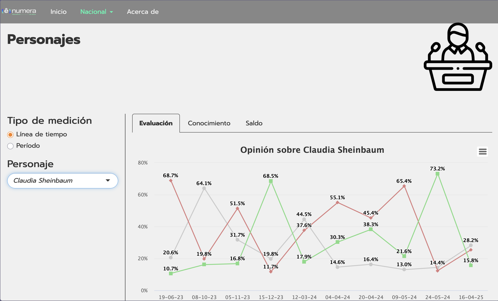

# Poll Explorer: Mexico 2024 Electoral Dashboard

An interactive dashboard, built with R Shiny, for exploring national opinion-poll results ahead of Mexico's 2024 presidential election. The interface is in Spanish.

> **Portfolio project only.**
> This repository exists to showcase my work. **All data displayed in the dashboard is fake** and was not collected in any real survey. Nothing shown here represents real public opinion, real polling results, or the position of any person, party or organization.

## Screenshots

**Login screen**

**Dashboard: "Personajes" section, time-line view**

## What the dashboard does

The dashboard turns survey microdata into interactive charts, so that results can be explored by wave and by demographic segment instead of read from static reports.

- **Login:** access is gated by a login screen (credentials stored hashed in a SQLite database). A public demo account is shown on the login page.
- **Home:** a landing page with cards linking to each analysis section.
- **Nacional**, with five sections:
  - **Personajes:** opinion, awareness and net balance for political figures.
  - **Cultura política:** evaluation of parties and brands, and voting-intention "ceilings".
  - **Elección presidencial:** head-to-head match-ups and voting scenarios.
  - **Evaluación de gobierno:** approval of the federal government and its performance by topic.
  - **Brújula ideológica:** positions on political and social issues.
- **Acerca de:** methodology, sample design and regional classification.

Each section can be viewed in two ways:

- **Línea de tiempo:** how a measure evolves across survey waves.
- **Período:** a single wave, filtered by segment (national, socioeconomic level, generation, sex or education).

## Built with

R, Shiny, shinydashboard, shinyWidgets, shinyauthr, highcharter (Highcharts), leaflet, tidyverse, DBI and RSQLite.

## Project structure

| Path | Contents |
|---|---|
| `app.R` | App entry point: UI, login and server wiring |
| `global.R` | Shared chart-building functions |
| `inicio.R`, `acerca.R` | Home and "About" pages |
| `Nacional/` | UI and server code for each national section |
| `www/Microdatos/` | Data-loading and preparation scripts |
| `www/` | Styles, fonts, icons and images |

## Running locally

Install the packages listed above, then run `shiny::runApp()` from the project folder. To log in, use the demo credentials shown on the login screen.

## Disclaimer

This is a demonstration project. The data is fabricated for illustration, and no conclusions about real voters, candidates or parties should be drawn from it.
